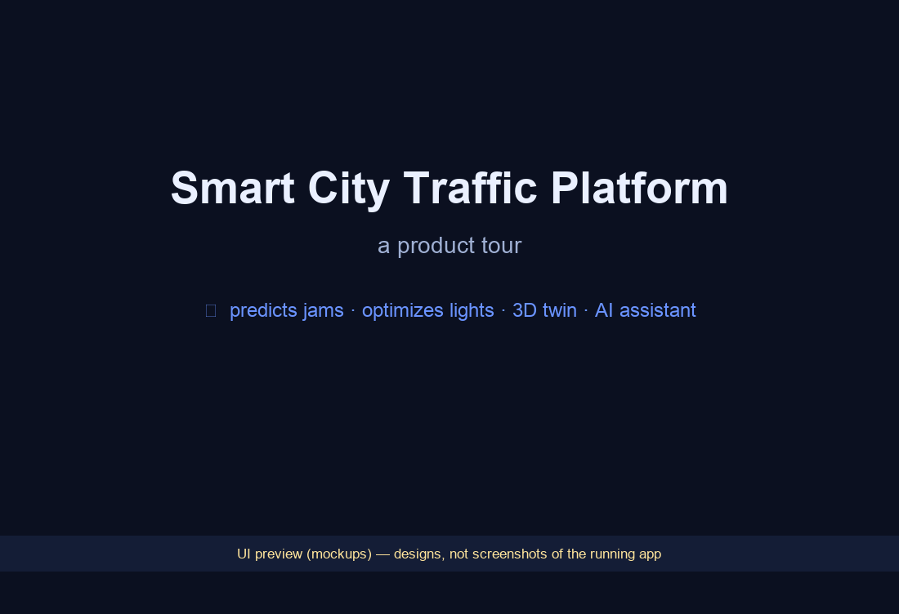
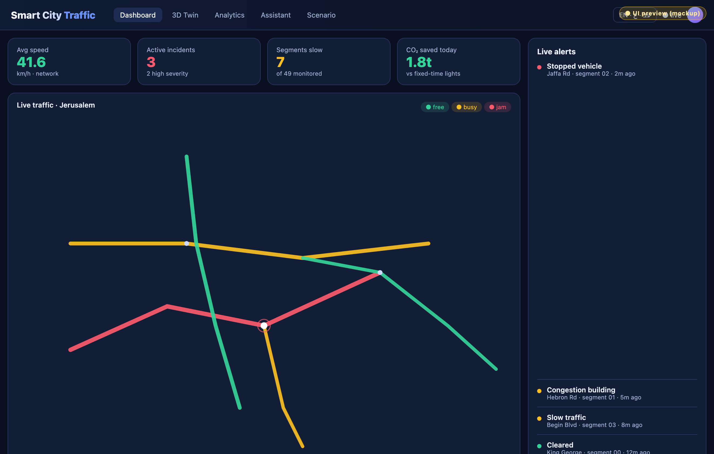
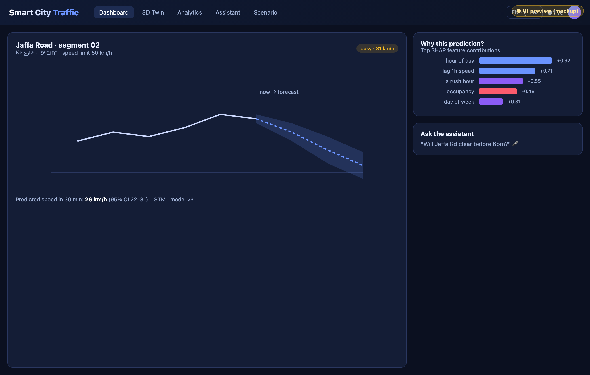
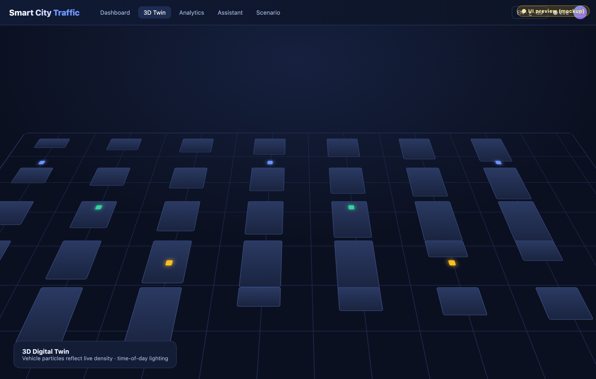
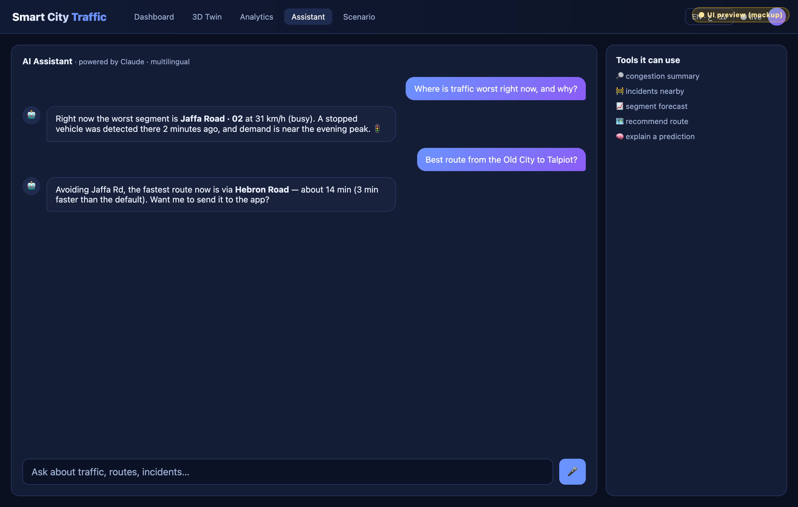

# Smart City Traffic Optimization Platform

> Real-time traffic intelligence for a simulated Jerusalem road network —
> sensor + camera ingestion, ML congestion forecasting, RL-optimized traffic
> signals, a 3D digital twin, and a Claude-powered assistant. Built as a
> production-grade, polyglot microservices system.

[](https://yousef-hamda.github.io/smart-city-traffic/EXPLAINER.html)
[](EXPLAINER.pdf)
&nbsp;·&nbsp; License: MIT · Languages: TypeScript · Python · Java

**Status: under active construction.** This README tracks reality, not
aspiration — sections appear as the phases that implement them land. The full
build plan lives in the commit history (one conventional-commit series per
phase) and [`docs/architecture.md`](docs/architecture.md).



> ⚠️ **The images above and below are UI previews (mockups)** — polished
> designs of the interface, **not** screenshots captured from the running app.
> They illustrate the intended product while the frontend is wired up. The
> traffic data throughout the platform comes from clearly-labeled simulators.

> [!TIP]
>
> ### 📘 Not a coder? Read this first — here's what's inside
>
> An animated, plain-language walkthrough (no jargon): a one-sentence summary
> and an everyday analogy, an animated "journey of a traffic reading", hover
> cards explaining each part (with the real "coder words"), one annotated code
> snippet, a mini-dictionary of tech terms, the screens below, and count-up
> stats.
>
> - **View online (rendered):** <https://yousef-hamda.github.io/smart-city-traffic/EXPLAINER.html>
>   _(once GitHub Pages is enabled — see [Viewing the explainer](#viewing-the-explainer))_
> - **Locally:** download & **double-click** [`EXPLAINER.html`](EXPLAINER.html)
> - **No browser?** open [`EXPLAINER.pdf`](EXPLAINER.pdf)
> - **Share as one file** (email/USB): [`EXPLAINER-standalone.html`](EXPLAINER-standalone.html) (images baked in)

## What it is

A multi-service platform that ingests live traffic telemetry (from honest,
clearly-labeled **simulators** — the engineering value is the system, not the
data source), processes it through Kafka and Flink, predicts congestion with
classical and deep-learning models, optimizes signal timing with reinforcement
learning against SUMO, and serves it all through a real-time geospatial
dashboard, a citizen mobile app, and a voice-and-text AI assistant — in
English, Hebrew (RTL), and Arabic (RTL).

## Quick start

```bash
# prerequisites: Docker Desktop, pnpm ≥ 9, GNU make
make dev        # full stack: infra + all services
make dev-infra  # just Postgres/Kafka/Redis/Mongo/Neo4j/MinIO/Mosquitto
make seed       # seed road segments, sensors, cameras, Neo4j graph
make sim        # start the sensor simulator
```

| Surface               | URL                        |
| --------------------- | -------------------------- |
| Dashboard             | http://localhost:3000      |
| API gateway (Swagger) | http://localhost:8080/docs |
| Developer portal      | http://localhost:3001      |

## Repository layout

```
apps/        14 deployable services (TS · Python · Java)
packages/    shared contracts: types · proto · ui · i18n
ml/          notebooks · training data · Feast repo · model artifacts
analytics/   dbt models · Superset dashboards
flink/       streaming jobs (windows + CEP)
neo4j/       road-graph seed + Cypher
infra/       docker · k8s · helm · istio · argocd · terraform · observability
docs/        architecture · ADRs · runbooks · chaos game-day
scripts/     seeds · kafka topics · load tests · security scans
```

## Screenshots

> **UI previews (mockups)** — interface designs, not captures of the running app.

|                                                             |                                                                             |
| ----------------------------------------------------------- | --------------------------------------------------------------------------- |
|   |  |
| **Live dashboard** — map, KPIs, alerts                      | **Segment drill-down** — forecast + SHAP                                    |
|  |                |
| **3D digital twin**                                         | **AI assistant** (EN · עברית · العربية)                                     |

## Viewing the explainer

GitHub shows the **source** of `.html` files, not the rendered page. Three ways
to see it properly:

1. **Locally (instant):** download [`EXPLAINER.html`](EXPLAINER.html) and
   double-click it (keep it next to `docs/images/`), or open the all-in-one
   [`EXPLAINER-standalone.html`](EXPLAINER-standalone.html) which needs nothing
   else.
2. **PDF:** open [`EXPLAINER.pdf`](EXPLAINER.pdf).
3. **Online (rendered) via GitHub Pages** — one-time setup: in the repo,
   **Settings ▸ Pages ▸ Build and deployment**, set **Source: Deploy from a
   branch**, **Branch: `main` / `/ (root)`**, Save. After a minute the site is
   live at <https://yousef-hamda.github.io/smart-city-traffic/> (the included
   `index.html` redirects to the explainer; `.nojekyll` keeps Pages from
   reprocessing the files). The README badges already point here.

> The explainer files are committed locally and need a `git push` before they
> appear on GitHub or Pages.

## Documentation

- [Architecture](docs/architecture.md) · [ADRs](docs/adr/) ·
  [ML](docs/ml.md) · [RL](docs/rl.md)
- Plain-language tour: [EXPLAINER.html](EXPLAINER.html) ·
  [standalone](EXPLAINER-standalone.html) · [PDF](EXPLAINER.pdf)
- Per-service READMEs under `apps/<service>/README.md`

## License

[MIT](LICENSE) — © Yousef Hasan Hamda
([LinkedIn](https://www.linkedin.com/in/yousef-hamda-1093a4352) ·
yousef123hamda@gmail.com)
