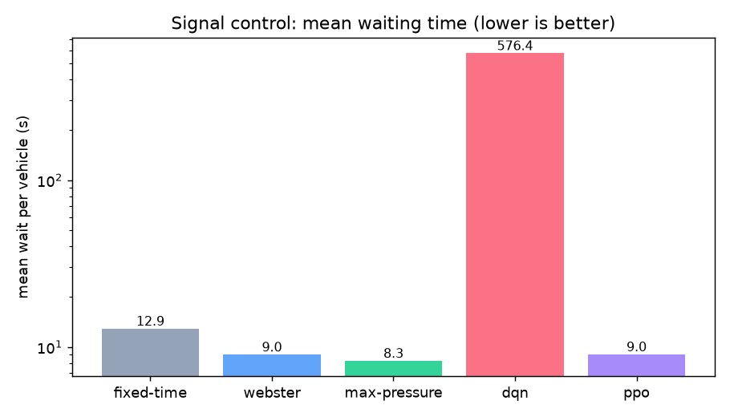

# Reinforcement Learning for Signal Control

The RL signal optimizer (`apps/rl-optimizer`) learns traffic-light timings and
is **benchmarked honestly against classical controllers**. The comparison —
not a bare claim that "RL wins" — is the deliverable. See
[ADR 0005](adr/0005-rl-for-signal-control.md) for the decision rationale.

## Environment

A custom `gymnasium.Env` over a cluster of four signalised intersections (the
pure-Python queue simulator in `intersection.py`; a SUMO/`traci` backend is
documented for when the binary is available, sharing the same contract).

- **Observation** — per approach: normalized queue length; per intersection:
  current-phase one-hot + time-in-phase, concatenated across the cluster.
- **Action** — `MultiDiscrete`, one phase per intersection (joint control).
- **Reward** — `-Δ(total delay)` each step (dense, aligned with the objective)
  minus a _small_ switching penalty (0.02). The penalty must stay well below the
  per-step delay signal: an early version used 0.25 and the agent learned to
  **never switch** — freezing into gridlock — a textbook reward-shaping trap.

## Agents & baselines

- **DQN** — off-policy value learning. The MultiDiscrete action is flattened to
  a single `Discrete(16)` via an `ActionWrapper` so DQN can drive it.
- **PPO** — on-policy policy gradient, native MultiDiscrete.
- **Fixed-time / Webster / Max-pressure** — the classical yardsticks.

## Results

Averaged over 3 seeds, 30-minute episodes, 150k training timesteps.



| Controller   | Throughput | Mean wait / vehicle (s) | Avg queue |
| ------------ | ---------: | ----------------------: | --------: |
| Fixed-time   |       2226 |                   12.89 |     15.81 |
| Webster      |       2227 |                    9.01 |     10.60 |
| Max-pressure |       2230 |                **8.26** |      9.46 |
| DQN          |       1244 |                  576.38 |    398.94 |
| **PPO**      |       2232 |                **9.04** |     10.77 |

(Full data: `apps/rl-optimizer/results/comparison.csv`.)

## Honest reading of the numbers

- **PPO works.** It cuts mean waiting time **~30% versus fixed-time**
  (12.89 → 9.04 s), matches Webster, and approaches max-pressure — with the
  highest throughput. The learned policy is genuinely competitive with
  hand-engineered control.
- **DQN struggles** on this problem. Off-policy value learning over the
  flattened joint action space (16 combinations) with default exploration is
  unstable here and collapses into long queues. This is a real, instructive
  result — _why_ PPO's on-policy policy gradient handles the coordinated
  MultiDiscrete control where vanilla DQN does not is a good discussion, not
  something to paper over.
- **Max-pressure is a strong baseline.** On simple, independent intersections
  it is provably stable and near-optimal, so it is hard to beat. RL's advantage
  grows with coordination complexity (correlated demand, green-wave offsets)
  and training budget — directions noted below.
- **Serving is conservative.** Because of the sim-to-real gap, the
  `/recommend/signal-timing` endpoint defaults to the tuning-free
  max-pressure + Webster recommendation and only prefers a trained RL policy
  when one is present and validated.

## Reproduce

```bash
cd apps/rl-optimizer && pip install -e ".[dev,train]"
python -m rl_optimizer.train --algo ppo --timesteps 150000 --compare
python -m rl_optimizer.train --algo dqn --timesteps 150000 --compare
```

## Next steps

- Coordinated multi-intersection scenarios (offsets / green waves) where RL's
  joint optimization should pull clearly ahead of greedy max-pressure.
- Longer training + hyperparameter search (Optuna) for DQN, or replace it with
  a Rainbow/QR-DQN variant better suited to the action space.
- Swap the pure-Python backend for SUMO and re-validate before any field use.
